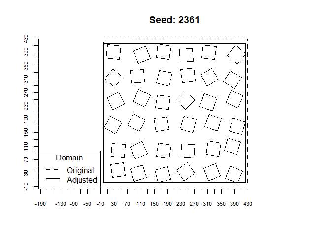

Simple building layout creator
================
William Morrison
19/03/2020

  - [Summary](#summary)
  - [Load packages and source the
    function](#load-packages-and-source-the-function)
  - [Define parameters](#define-parameters)
  - [Run the function](#run-the-function)
  - [Explore the output](#explore-the-output)
      - [Polygons](#polygons)
      - [Data frame](#data-frame)
  - [Validate across a wide range of
    inputs](#validate-across-a-wide-range-of-inputs)

# Summary

Create a simple distribution of buildings. Buildings have square plan
area and normally distributed heights. The rotation of buildings can be
defined. The output allows saving as data frame (centroids of buildings)
and polygon shape file (building plan with height statistics). This
document outlines the general R usage.

# Load packages and source the function

``` r
library(tidyr)
library(rgeos)
library(raster)
library(sp)
library(maptools)
library(rgdal)

source("R/functions.R")
```

# Define parameters

``` r
#for the random operations
seedVal <- 2361
#total buildings in domain (forces building separation and width)
nBuildings <- 40
#plan area build fraction (lambda_p) (forces building separation and width)
lambda_p <- 0.3
#desired DART domain horizontal length in X and Y (m)
DART_XorY_m <- 430
#DART building size (m) - the size of a DART cube in XYZ.
#all other building sizes in this code are scaled based on this size
DARTbuildSizeXY <- 1
#in XY coordinates, maximum spread of a building centroid from its regular grid location
#(multiplicative factor of distance between building centroids)
#e.g. building centroid distance bD = 10 (m) and XYoffset_factor = 0.5.
#Buildings will randomly be located at x'= x +- 2.5 m and y' = y +- 2.5 m
XYoffset_factor <- 0.25
#maximum building rotation +- north (deg). use 45 deg for most random (assuming nBuildings is large)
maxBuildRotation <- 45
#building heights, to calculate a normal distribution of heights across all buildings
#mean building height (m)
z_mean = 30
#standard deviation of building height (m)
z_sd = 5
```

# Run the function

``` r
buildDistribution <- createBuildingDistribution(nBuildings = nBuildings, 
                                                lambda_p = lambda_p, 
                                                z_mean = z_mean, 
                                                z_sd = z_sd, 
                                                DART_XorY_m = DART_XorY_m, 
                                                DARTbuildSizeXY = DARTbuildSizeXY,
                                                XYoffset_factor = XYoffset_factor, 
                                                maxBuildRotation = maxBuildRotation, 
                                                seedVal = seedVal)
```

# Explore the output

## Polygons

``` r
polygonData <- buildDistribution$polygons
#the new domain will be slightly different
newDomainExtent <- bbox(buildDistribution$polygons)

plot(polygonData, main = paste("Seed:", seedVal))
axis(1, at = seq(-DART_XorY_m, DART_XorY_m, by = 20), cex.axis = 0.7)
axis(2, at = seq(-DART_XorY_m, DART_XorY_m, by = 20), cex.axis = 0.7)
rect(xleft = 0, ybottom = 0, xright = newDomainExtent["x", "max"], 
     ytop = newDomainExtent["y", "max"], lwd = 2)
rect(xleft = 0, ybottom = 0, xright = 430, 
     ytop = 430, lwd = 2, lty = 2)
legend("bottomleft", legend = c("Original", "Adjusted"), lty = c(2, 1), lwd = 2, ncol = 1, title = "Domain")
```

<!-- -->

``` r
actualPAI <- sum(area(polygonData)) / (newDomainExtent["x", "max"] * newDomainExtent["y", "max"])
print(paste("desired PAI:",lambda_p, "actual PAI:", actualPAI))
```

    ## [1] "desired PAI: 0.3 actual PAI: 0.316696348161596"

``` r
polyFile <- "data/samplePoly"

writeOGR(obj = polygonData, dsn = polyFile, driver = "ESRI Shapefile", layer = "z", overwrite_layer = TRUE)
```

## Data frame

``` r
DARTdfData <- buildDistribution$df
head(DARTdfData)
```

    ##   objInd        x         y z   Xscale   Yscale   Zscale Xrot Yrot       Zrot
    ## 1      0 352.6977  44.12819 0 19.62672 19.62672 27.19785    0    0   7.937633
    ## 2      0 361.9480 105.48780 0 19.62672 19.62672 21.93710    0    0  17.705560
    ## 3      0 366.3399 178.28988 0 19.62672 19.62672 33.14919    0    0  13.621507
    ## 4      0 358.4458 245.90878 0 19.62672 19.62672 30.01500    0    0  34.241093
    ## 5      0 359.0699 325.39034 0 19.62672 19.62672 22.94304    0    0  21.847167
    ## 6      0 365.9624 391.06467 0 19.62672 19.62672 35.93876    0    0 338.659147

``` r
DFfile <- "data/DART_building_field.txt"
unlink(DFfile)
write.table(x = DARTdfData, file = DFfile, sep = " ", col.names = FALSE, 
            row.names = FALSE, append = TRUE)
```

# Validate across a wide range of inputs

``` r
samplePerms <- expand.grid(nBuildings = seq(20, 100, by = 40), 
                           lambda_p = seq(0.2, 0.8, by = 0.2),
                           DART_XorY_m = seq(200, 1000, by = 400),
                           XYoffset_factor = seq(0, 0.4, by = 0.2),
                           maxBuildRotation = c(0, 45))
library(foreach)
```

    ## Warning: package 'foreach' was built under R version 3.6.3

``` r
library(doParallel)
```

    ## Warning: package 'doParallel' was built under R version 3.6.3

    ## Loading required package: iterators

    ## Warning: package 'iterators' was built under R version 3.6.3

    ## Loading required package: parallel

``` r
nCores <- 6
cl <- parallel::makeCluster(nCores)
doParallel::registerDoParallel(cl)
out <- foreach(i = 1:nrow(samplePerms), .packages = c("raster", "tidyr", "rgeos")) %dopar% {
  createBuildingDistribution(nBuildings = samplePerms$nBuildings[i], 
                             lambda_p = samplePerms$lambda_p[i], 
                             z_mean = z_mean, 
                             z_sd = z_sd, 
                             DART_XorY_m = samplePerms$DART_XorY_m[i], 
                             DARTbuildSizeXY = DARTbuildSizeXY,
                             XYoffset_factor = samplePerms$XYoffset_factor[i], 
                             maxBuildRotation = samplePerms$maxBuildRotation[i], 
                             seedVal = seedVal, maxIters = 50)
  
}
stopCluster(cl)
isFailedSim <- sapply(out, is.null)
out_filtered <- out[which(!isFailedSim)]
calcPAI <- function(x) {
  sum(area(x)) / (bbox(x)["x", "max"] * bbox(x)["y", "max"])
}

finalPAI <- unlist(lapply(out_filtered, function(x) calcPAI(x$polygons)))
expectedPAI <- samplePerms$lambda_p[which(!isFailedSim)]
nIters <- sapply(out_filtered, function(x) x$nIters)
plot(expectedPAI, finalPAI, pch = 20)
abline(0, 1, col = "red")
```

<!-- -->

``` r
paste("MAE:", mean(abs(finalPAI - expectedPAI)))
```

    ## [1] "MAE: 0.0285429243833829"
