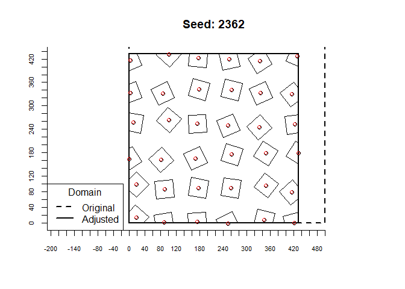
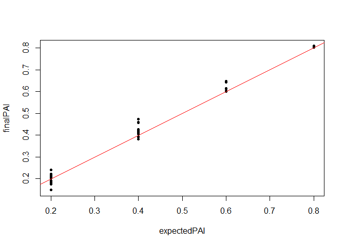

Simple building layout creator
================
William Morrison
19/03/2020

  - [Summary](#summary)
  - [Load packages and source the
    function](#load-packages-and-source-the-function)
  - [Define parameters](#define-parameters)
  - [Run the function](#run-the-function)
  - [Explore the output](#explore-the-output)
      - [Polygons](#polygons)
      - [Data frame](#data-frame)
      - [Parameters](#parameters)
  - [Write data](#write-data)
  - [Validate across a wide range of
    inputs](#validate-across-a-wide-range-of-inputs)

# Summary

A quick functon to create a simple distribution of buildings in ESRI
shape file and Discrete Anisotropic Radiative Transfer (DART) building
field format. Adjust domain area, and building: plan area, height and
rotation.

# Load packages and source the function

``` r
library(tidyr)
library(rgeos)
library(raster)
library(sp)
library(maptools)
library(rgdal)

source("R/functions.R")
```

# Define parameters

``` r
#for the random operations
seedVal <- 2362
#total buildings in domain (forces building separation and width)
nBuildings <- 40
#plan area build fraction (lambda_p) (forces building separation and width)
lambda_p <- 0.3
#desired DART domain horizontal length in X and Y (m)
DART_XorY_m <- 500
#DART building size (m) - the size of a DART cube in XYZ.
#all other building sizes in this code are scaled based on this size
DARTbuildSizeXYZ <- 2
#in XY coordinates, maximum spread of a building centroid from its regular grid location
#(multiplicative factor of distance between building centroids)
#e.g. building centroid distance bD = 10 (m) and XYoffset_factor = 0.5.
#Buildings will randomly be located at x'= x +- 2.5 m and y' = y +- 2.5 m
XYoffset_factor <- 0.25
#maximum building rotation +- north (deg). use 45 deg for most random (assuming nBuildings is large)
maxBuildRotation <- 45
#building heights, to calculate a normal distribution of heights across all buildings
#mean building height (m)
z_mean <- 30
#standard deviation of building height (m)
z_sd <- 5
```

# Run the function

``` r
buildDistribution <- createBuildingDistribution(nBuildings = nBuildings, 
                                                lambda_p = lambda_p, 
                                                z_mean = z_mean, 
                                                z_sd = z_sd, 
                                                DART_XorY_m = DART_XorY_m, 
                                                DARTbuildSizeXYZ = DARTbuildSizeXYZ,
                                                XYoffset_factor = XYoffset_factor, 
                                                maxBuildRotation = maxBuildRotation, 
                                                seedVal = seedVal)
```

    ## Loading required package: dplyr

    ## 
    ## Attaching package: 'dplyr'

    ## The following objects are masked from 'package:raster':
    ## 
    ##     intersect, select, union

    ## The following objects are masked from 'package:rgeos':
    ## 
    ##     intersect, setdiff, union

    ## The following objects are masked from 'package:stats':
    ## 
    ##     filter, lag

    ## The following objects are masked from 'package:base':
    ## 
    ##     intersect, setdiff, setequal, union

# Explore the output

``` r
#a list with some data and meta data (in no sane order)
names(buildDistribution)
```

    ## [1] "polygons"         "df"               "shiftAmount"      "params"          
    ## [5] "polygonCentroids"

## Polygons

``` r
polygonData <- buildDistribution$polygons
#the new domain will be slightly different
newDomainExtent <- buildDistribution$params$domainExtent

plot(polygonData, main = paste("Seed:", seedVal))
axis(1, at = seq(-DART_XorY_m, DART_XorY_m, by = 20), cex.axis = 0.7)
axis(2, at = seq(-DART_XorY_m, DART_XorY_m, by = 20), cex.axis = 0.7)
rect(xleft = 0, ybottom = 0, xright = newDomainExtent["x", "max"], 
     ytop = newDomainExtent["y", "max"], lwd = 2)
rect(xleft = 0, ybottom = 0, xright = buildDistribution$params$DART_XorY_m, 
     ytop = buildDistribution$params$DART_XorY_m, lwd = 2, lty = 2)
legend("bottomleft", legend = c("Original", "Adjusted"), lty = c(2, 1), lwd = 2, ncol = 1, title = "Domain")
#raw polygon centroids
points(buildDistribution$polygonCentroids, cex = 1)
#centroids shifted to DART coordinates (DART x=0,y=0 origin is top left, x is down and y is right)
points(buildDistribution$df$y, 
       (buildDistribution$params$domainExtent[,2][2] - buildDistribution$df$x), col = "red", cex = 0.8)
```

<!-- -->

``` r
actualPAI <- sum(area(polygonData)) / (newDomainExtent["x", "max"] * newDomainExtent["y", "max"])
print(paste("desired PAI:",lambda_p, "actual PAI:", actualPAI))
```

    ## [1] "desired PAI: 0.3 actual PAI: 0.306258745517568"

## Data frame

``` r
DARTdfData <- buildDistribution$df
head(DARTdfData)
```

    ##   objInd        x         y z   Xscale   Yscale   Zscale Xrot Yrot       Zrot
    ## 1      0 449.2653  48.66473 0 22.82177 22.82177 19.46556    0    0 318.332834
    ## 2      0 461.2503 120.01312 0 22.82177 22.82177 14.69256    0    0  10.107818
    ## 3      0 459.9300 204.66671 0 22.82177 22.82177 16.04018    0    0   4.404305
    ## 4      0 464.6367 283.29333 0 22.82177 22.82177 21.80902    0    0  24.737295
    ## 5      0 455.5496 375.71375 0 22.82177 22.82177 15.69572    0    0 345.481068
    ## 6      0 462.5175 452.07925 0 22.82177 22.82177 18.43375    0    0  15.582118

## Parameters

The paramters are stored in a yaml file
(e.g. rBldgsParams\_*fileID*.yml) with the following fields:

### Defined values

See above code examples for details on these defined values:

    nBuildings: number of buildings
    lambda_p: plan area index
    z_mean: mean building height (m)
    z_sd: building height standard deviation (m)
    DART_XorY_m: Domain area in X or Y (m)
    DARTbuildSizeXYZ: Size of DART building obj (m)
    XYoffset_factor: (See code examples)
    maxBuildRotation: Building rotation around domain North
    maxIters: Maximum iterations allowed

### Output values

    seedVal: Seed value used
    iters: Number of iterations it took to get a result
    domainExtent:
      - minX - should be zero (m)
      - minY - should be zero (m)
      - maxX (maxY in DART coordinates) (m)
      - maxY (maxX in DART coordinates) (m)
    newPAI: Final plan area index

# Write data

``` r
oDir <- getwd()
unlink("sampleData", recursive = TRUE)
#set fID to give manual file ID, else will give random string
oDir_ID <- writebuildDistribution(buildDistribution, oDir, fID = "sampleData")
list.files(oDir_ID)
```

    ## [1] "DART_fields_sampleData.txt"  "rBldgsParams_sampleData.yml"
    ## [3] "z.dbf"                       "z.shp"                      
    ## [5] "z.shx"

# Validate across a wide range of inputs

``` r
samplePerms <- expand.grid(nBuildings = seq(20, 100, by = 40),
                           lambda_p = seq(0.2, 0.8, by = 0.2),
                           DART_XorY_m = seq(200, 1000, by = 400),
                           XYoffset_factor = seq(0, 0.4, by = 0.2),
                           maxBuildRotation = c(0, 45))

library(foreach)
```

    ## Warning: package 'foreach' was built under R version 3.6.3

``` r
library(doParallel)
```

    ## Warning: package 'doParallel' was built under R version 3.6.3

    ## Loading required package: iterators

    ## Warning: package 'iterators' was built under R version 3.6.3

    ## Loading required package: parallel

``` r
nCores <- 4
cl <- parallel::makeCluster(nCores)
doParallel::registerDoParallel(cl)
out <- foreach(i = 1:nrow(samplePerms), .packages = c("raster", "tidyr", "rgeos")) %dopar% {
  createBuildingDistribution(nBuildings = samplePerms$nBuildings[i], 
                             lambda_p = samplePerms$lambda_p[i], 
                             z_mean = z_mean, 
                             z_sd = z_sd, 
                             DART_XorY_m = samplePerms$DART_XorY_m[i], 
                             DARTbuildSizeXYZ = DARTbuildSizeXYZ,
                             XYoffset_factor = samplePerms$XYoffset_factor[i], 
                             maxBuildRotation = samplePerms$maxBuildRotation[i], 
                             seedVal = seedVal, maxIters = 50)
  
}
stopCluster(cl)
isFailedSim <- sapply(out, is.null)
out_filtered <- out[which(!isFailedSim)]

finalPAI <- unlist(lapply(out_filtered, function(x) x$params$newPAI))
expectedPAI <- samplePerms$lambda_p[which(!isFailedSim)]
nIters <- sapply(out_filtered, function(x) x$params$iters)
plot(expectedPAI, finalPAI, pch = 20)
abline(0, 1, col = "red")
```

<!-- -->

``` r
paste("MAE:", mean(abs(finalPAI - expectedPAI)))
```

    ## [1] "MAE: 0.0271638994384761"
